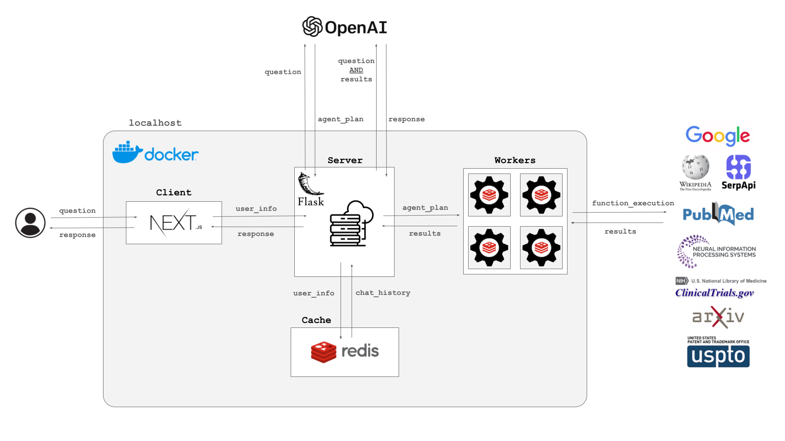

<div align="center">
    <h1>Redis Agent</h1>
    <a href="https://github.com/attuneintelligence/redis-agent/actions">
      
    </a>
    <a href="https://github.com/attuneintelligence/redis-agent">
      
    </a>
    <a href="https://github.com/attuneintelligence/redis-agent/issues">
      
    </a>
    <a href="https://github.com/attuneintelligence/redis-agent/blob/main/LICENSE">
      
    </a>
    <a href="https://twitter.com/reedbndr">
      
    </a>
    <hr>
    <!-- <blockquote>“Such is my task. I go to gather this, the sacred knowledge, here and there dispersed about the world, long lost or never found.”<br>- <i>Browning's Paracelsus</i></blockquote> -->
    <blockquote>“Intelligence is a fixed goal with variable means of achieving it.”<br><i>-William James</i></blockquote>
    <br>
</div>

Designing cognitive architectures capable of agency is a notoriously difficult task. Base language models are confined to the knowledge of their training, and retrieval-augmented generation (RAG) pipelines generally follow a rigid pipeline for execution.

`Redis-Agent` leverages Chain-of-Thought reasoning to generate a plan of action for complex questions, and then offloads the task of function calling to a queue of Redis workers for concurrent execution.

Created and maintained by _[Reed Bender](https://github.com/mrbende)_.

<div align="center">
  
</div>

---

# Getting Started

## Step 1: Install Docker
  Install [Docker](https://docs.docker.com/get-docker/) on your machine if it is not already installed.

## Step 2: Compile API Keys
1. _**[OpenAI Key](https://platform.openai.com/api-keys)**_ 
    - OpenAI 
2. _**[SerpAPI Key](https://serpapi.com/dashboard)**_ (*optional*)
    - This key connects to SerpAPI, which enables web search function calling.
2. _**[Pubmed Key](https://account.ncbi.nlm.nih.gov/settings/)**_ (*optional*)
    - This key connects to Pubmed, connecting the agent to published biomedical literature.

Once each of these keys has been acquired (or only the OpenAI key to launch with a subset of available functions), the installation and deployment can be executed.

Create a `.env` file at `server/.env` to provide authentification to the locally deployed application.

```bash
OPENAI_API_KEY=""

### SERPAPI AUTH   (optional)
SERPAPI_API_KEY=""

### PUBMED API AUTH   (optional)
PUBMED_EMAIL="user@email.com"
PUBMED_API_KEY=""
```

## Step 3: Deployment

```bash
### START
docker-compose up --build
```

The application will then be made accessible at _[http://localhost:3000](http://localhost:3000)_.

---