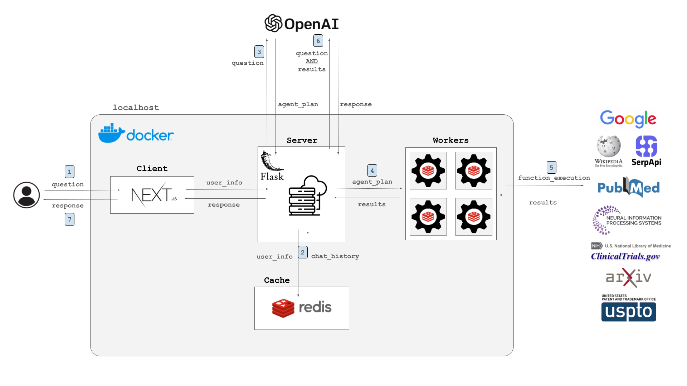

<div align="center">
    <h1>Redis Agent</h1>
    <a href="https://github.com/attuneintelligence/redis-agent/actions">
      
    </a>
    <a href="https://github.com/attuneintelligence/redis-agent">
      
    </a>
    <a href="https://github.com/attuneintelligence/redis-agent/issues">
      
    </a>
    <a href="https://github.com/attuneintelligence/redis-agent/blob/main/LICENSE">
      
    </a>
    <a href="https://twitter.com/reedbndr">
      
    </a>
    <hr>
    <!-- <blockquote>“Such is my task. I go to gather this, the sacred knowledge, here and there dispersed about the world, long lost or never found.”<br>- <i>Browning's Paracelsus</i></blockquote> -->
    <blockquote>“Intelligence is a fixed goal with variable means of achieving it.”<br><i>-William James</i></blockquote>
    <br>
</div>

Designing cognitive architectures capable of agency is a notoriously difficult task. Base language models are confined to the knowledge of their training, and retrieval-augmented generation (RAG) pipelines generally follow a rigid pipeline for execution.

`Redis-Agent` leverages Chain-of-Thought reasoning to generate a plan of action for complex questions, and then offloads the task of function calling to a queue of Redis workers for concurrent execution.

Created and maintained by _[Reed Bender](https://github.com/mrbende)_.

<div align="center">
  
</div>

---

# Getting Started

## Step 1: Install Docker
  Install [Docker](https://docs.docker.com/get-docker/) on your machine if it is not already installed.

## Step 2: Compile API Keys
1. _**[OpenAI Key](https://platform.openai.com/api-keys)**_ 
    - OpenAI 
2. _**[SerpAPI Key](https://serpapi.com/dashboard)**_ (*optional*)
    - This key connects to SerpAPI, which enables web search function calling.
2. _**[Pubmed Key](https://account.ncbi.nlm.nih.gov/settings/)**_ (*optional*)
    - This key connects to Pubmed, connecting the agent to published biomedical literature.

Once each of these keys has been acquired (or only the OpenAI key to launch with a subset of available functions), the installation and deployment can be executed.

Create a `.env` file at `server/.env` to provide authentification to the locally deployed application.

```bash
OPENAI_API_KEY=""

### SERPAPI AUTH   (optional)
SERPAPI_API_KEY=""

### PUBMED API AUTH   (optional)
PUBMED_EMAIL="user@email.com"
PUBMED_API_KEY=""
```

## Step 3: Deployment

```bash
### START
docker-compose up --build
```

This will launch the application on your local machine, available at _[http://localhost:3000](http://localhost:3000)_.

---

# Features

`Redis-Agent` integrates a [Redis Queue](https://redis.io/glossary/redis-queue/) to offload the execution of function calls to collection of workers in a first-in-first-out schema, leaving the primary Flask server free to process user requests. This allows for concurrent execution of multiple functions, reducing the time to first token generation of the streamed LLM response while executing multiple functions in parallel.

Prior to employing the agent workers, the user's question is sent to GPT to generate a sequential plan of action with Chain-of-Thought reasoning, defining a logical series of function queries to pull source-referenced information to support the response generation.

Chat history for the user's conversation is maintained in the Redis container, summarizing the chat thread with each iteration to fit within the LLM's context window limit while maintaining conversational context.

The application client is a simple NextJS + React chat interface, deployed to localhost for self-hosted interaction. The complete technical stack can also be deployed to a production application server with minimal changes.  

### Available Functions

The default tools available to the `Redis-Agent` system work together to inform ChatGPT's response with source-referenced supplemental information. The following tools are available to the deployed agent:
* [Pubmed](https://pubmed.ncbi.nlm.nih.gov/)
    - Access peer-reviewed clinical and biomedical research literature.
* [ClinicalTrials.gov](https://clinicaltrials.gov/)
    - Access current clinical trials from arround the world.
* [arXiv](https://arxiv.org/)
    - Access literature regarding physics, mathematics, computer science, and quantitative biology.
* [US Patent & Trademark Office](https://www.uspto.gov/patents/search)
    - Access granted and submitted patents from the USPTO.
* [Neurips](https://proceedings.neurips.cc/)
    - Access proceedings from the Neural Information Processing Systems conference.
* [Github](https://github.com/dashboard)
    - Access source code repositories.
* [Google Scholars Profile](https://scholar.google.com/intl/en/scholar/citations.html)
    - Access the scholar profile for any individual's academic research publications.
* [Google Search](https://www.google.com/webhp)
    - Access the complete internet.

These functions work together as an integrated pool of source information available to the deployed digital agent.

---

# Chain of Action

With each question submitted to the NextJS client application, the following process is initiated within the server:

<div align="center">
  
</div>

## Step 1: Question Submission

Interacting within the NextJS application exposed at [http://localhost:3000](http://localhost:3000), the user submits a question to the `Redis-Agent` within the context of an ongoing conversation.

With this, the default user information provided in `client/app/page.js` is passed from the client to the server application along with the question asked.

## Step 2: Chat History Retrieval

The iteratively-summarized chat thread is retrieved from the deployed Redis container, adding conversational context to the question passed from the client.

ChatGPT summarizes this conversation history with each ingress that exceeds a pre-set token limit, ensuring that the conversation can continue indefinitely without exceeding the LLM context window.

## Step 3: Chain-of-Thought Planning

The aggregated conversation thread is sent to ChatGPT with the instruction to think of a series of steps necessary to adequately answer the provided question. This sequential reasoning allows the agent to conceptualize multi-step thought processes, defining the series of function calls which will source the proper information from the proper repositories.

**Question**: "What is the most common gene mutation in kidney cancer, and who are the people researching those genes?"

**Generated Plan**:

```bash
{
    'step_1': {
        'description': 'Identify the most common gene mutation in kidney cancer and gather information on researchers involved in studying these genes.',
        'actions': [
            {
                'function': 'search_pubmed',
                'query': 'most common gene mutation in kidney cancer'
            },
            {
                'function': 'search_pubmed',
                'query': 'researchers studying gene mutations in kidney cancer'
            }
        ]
    },
    'step_2': {
        'description': 'Research the academic profiles and contributions of the identified researchers from step 1.',
        'actions': [
            {
                'function': 'search_academic_scholars',
                'query': '<name of identified researcher 1> kidney cancer gene mutation'
            },
            {
                'function': 'search_academic_scholars',
                'query': '<name of identified researcher 2> kidney cancer genetics'
            },
            {
                'function': 'search_academic_scholars',
                'query': '<name of identified researcher 3> kidney cancer molecular biology'
            }
        ]
    },
    'step_3': {
        'description': 'Compile the retrieved information into a final answer.',
        'actions': [
            {
                'function': 'return_answer'
            }
        ]
    }
}
```

This chain of thought is organized such that information which can be concurrently generated is executed in the same step, and those steps which require supplemental knowledge from other functions are executed in subsequent steps.

With this pre-planning step, the agent is allowed to dynamically take thoughtful actions in parallel and in series while guarding against runaway function loops.

## Step 4: Enqueue Redis Workers

Starting with `step_1` of the generated plan, each of the parallel function calls are queued to the Redis workers for execution. 

By offloading the work of functions to worker nodes, and launching their execution in parallel, the Flask server is left available to handle other user queries while dramatically improving the time-to-first-token compared to agents which serially execute functions. 

Additionally, this offloads the work of potentially long-running functions away from the Flask server so it can remain available to route the requests of other users. While this is less of a concern for a locally running application, this architecture is well-suited for a production application which must handle many concurrent user requests.

These available functions are defined as static methods and wrapped in the `src/agent/tools.json` toolset definitions.


## Step 5: Function Execution

Each of the Redis workers then executes the function with the query provided to it, returning the list of compiled responses back to the Flask server.

When the function responses for `step_1` are returned by the Redis Queue, the planning step is repeated to fill in the query definitions for the following step which is then re-submitted to the Redis workers. This process is repeated until the agent's max iterations are exceeded, or the stop sequence is returned by the function planner.

## Step 6: Response Generation

Once the agent's execution has completed, the compressed conversation history, question, and compiled function responses are all compiled into a new prompt and sent back to ChatGPT for generation of the final response.

This incorporates the agent's actions into a more personable persona, wrapping the derived information into a natural conversational response with source-derived information.

## Step 7: Client Streaming

This personalized response is streamed from ChatGPT back to the server, which is immediately streamed to the client application. 

The time-to-first-token, therefore, is drastically reduced enabling for a more naturally flowing conversation with the agent.

---

<blockquote>“Such is my task. I go to gather this, the sacred knowledge, here and there dispersed about the world, long lost or never found.”<br>- <i>Browning's Paracelsus</i></blockquote>